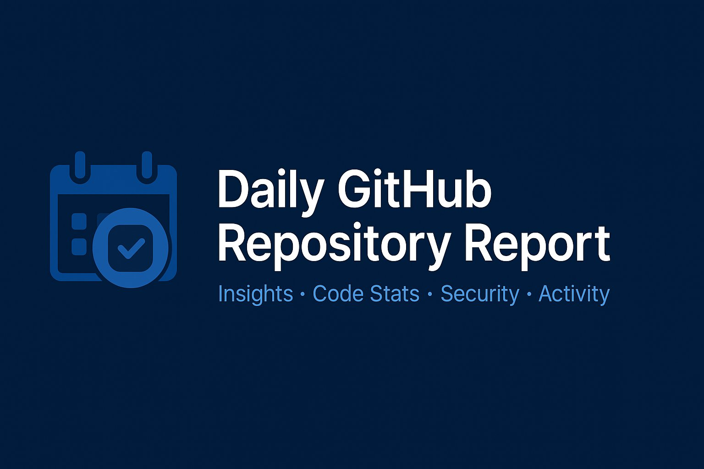

  

GitHub Daily Report Generator (Markdown + Email)     

<h2>Table of Contents</h2>

- [Installation](#installation)
- [Description](#description)
- [Usage](#usage)
- [Credits](#credits)

## Installation

## Description

GitHub Daily Report Generator (Markdown + Email)

## Usage

## Credits

- [Joerg Heinrich](@jfheinrich)
